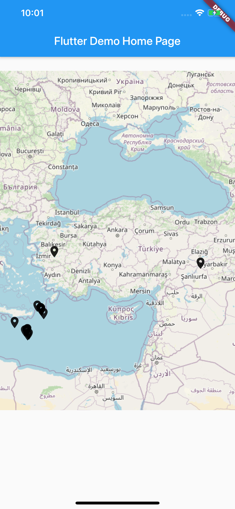
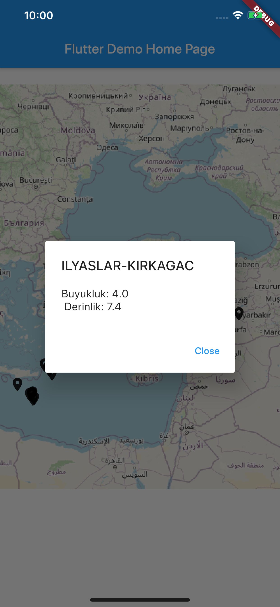

# deprem_haritasi

It shows that the latest earthquakes happened around Turkey. It indicates that using flutter_maps package and dialogs in an easy way by having futurebuilder and listview.builder at the same time. 

To execute the app, you may create required files with 'flutter create .' command.

## Getting Started

This project is a starting point for a Flutter application.

A few resources to get you started if this is your first Flutter project:

- [Lab: Write your first Flutter app](https://flutter.dev/docs/get-started/codelab)
- [Cookbook: Useful Flutter samples](https://flutter.dev/docs/cookbook)

For help getting started with Flutter, view our
[online documentation](https://flutter.dev/docs), which offers tutorials,
samples, guidance on mobile development, and a full API reference.
